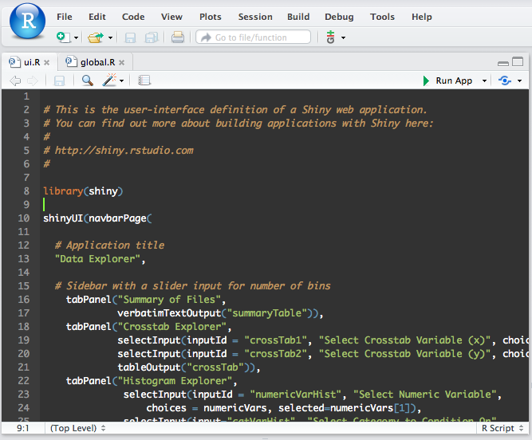
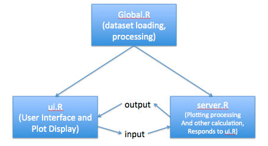

```{r setup, include=FALSE}
knitr::opts_chunk$set(echo = FALSE)
```

## What is an Interactive Visualization?

- Graphs with controls that alter the form or underlying data of graph
- Types of Control:
  - Presentation (type of graph)
  - Underlying Data (filtering based on criteria)

## Decide the purpose of your Visualization

- Very Important! 
- Exploration (EDA) 
- Question Answering
  - Is transcript abundance correlated with mutational load?
  - Is alcohol preference associated with behavioral covariates?

## Tips: Filtering Data

- Don't show all the data! 
  - Usually, a subset of your data can answer your question
  - filter your dataset beforehand
- Think carefully about the interactive element
  - Each slider and input box should have a purpose!

##What is Shiny?

Shiny is a web presentation framework that allows you to take R code and make it into an interactive visualization. 

We'll use it for the workshop today.

##Running a Shiny App

You can use `runApp()` if your working directory is the same as the app, but I usually just use the `runApp` button in the corner of the Rstudio window when I am editing `global.R`, `ui.R`, or `server.R`.



##Shiny App Architecture

For the workshop, you'll use the Shiny App to do some EDA. You will need to be familiar with the basic architecture of the app.

- `global.R` - This is where you'll do the majority of the work - place filtering and processing steps here. Any objects loaded here can be seen by both the `ui.R` and `server.R`.
- `ui.R` - This is where the user interface and display elements are. Communicates with `server.R` with `input` object (values from ui Elements). Gets output elements with the `output` object provided by `server.R`.
- `server.R` - All of the actual processing and plotting goes here. Gets UI values from `input` object and places the elements to be plotted in the `output` object so `ui.R` can access it.



## What you'll do today

- Start with a simple visualization (boxplot) with ggplot2()
- Change the x-axis with a selectInput() control
- Filter the data with dplyr()
